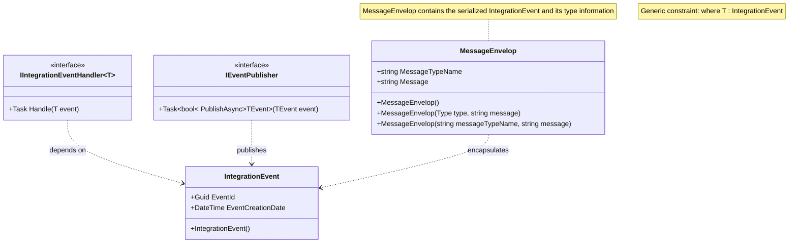

```mermaid
classDiagram
    class MessageEnvelop {
        +string MessageTypeName
        +string Message
        +MessageEnvelop()
        +MessageEnvelop(Type type, string message)
        +MessageEnvelop(string messageTypeName, string message)
    }
    
    class IntegrationEvent {
        +Guid EventId
        +DateTime EventCreationDate
        +IntegrationEvent()
    }
    
    %% Interfaces
    class IEventPublisher {
        <<interface>>
        +Task~bool~ PublishAsync~TEvent~(TEvent event)
    }
    
    class IIntegrationEventHandler~T~ {
        <<interface>>
        +Task Handle(T event)
    }
    
    %% Relationships
    IIntegrationEventHandler~T~ ..> IntegrationEvent : depends on
    IEventPublisher ..> IntegrationEvent : publishes
    MessageEnvelop ..> IntegrationEvent : encapsulates
    
    %% Notes
    note for MessageEnvelop "MessageEnvelop contains the serialized IntegrationEvent and its type information"
    note for IIntegrationEventHandler~T~ "Generic constraint: where T : IntegrationEvent"
```