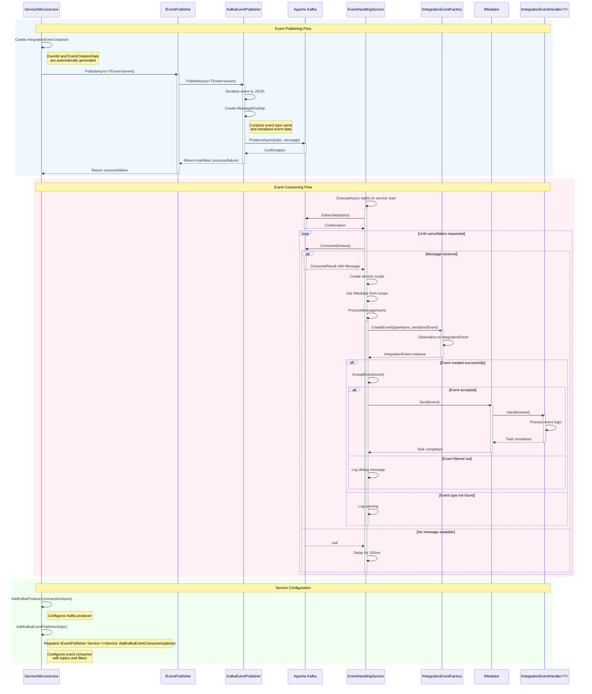

# EventBus Flow Diagram

## EventBus Sequence Diagram Explanation

The diagram illustrates the event-driven architecture implemented in the EventBus project, which uses Apache Kafka as the message broker. Here's a breakdown of the key components and flows:

### Key Components:

1. **Service/Microservice**: Application service that publishes events
2. **IEventPublisher**: Interface defining the contract for publishing events
3. **KafkaEventPublisher**: Implementation that serializes events and sends them to Kafka
4. **Apache Kafka**: Message broker for reliable message delivery
5. **EventHandlingService**: Background service that consumes events from Kafka 
6. **IIntegrationEventFactory**: Creates event objects from serialized data
7. **IMediator**: MediatR component that routes events to appropriate handlers
8. **IIntegrationEventHandler<T>**: Interface for handling specific event types