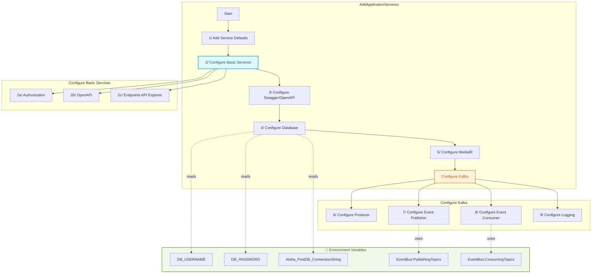
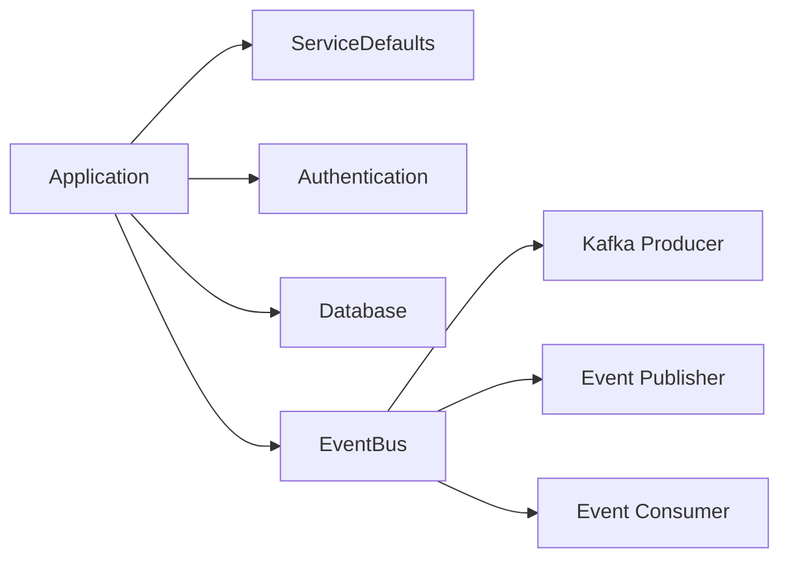

# ApplicationServiceExtensions Guide 🛠️

> Extension class để cấu hình và khởi tạo các services cho Aloha Post Microservice


## 🔄 Service Registration Flow

#### Đây là flow để implement các method vào class, các bước cần implement đã được đánh số thứ tự trong diagram



## 📊 Dependencies Flow




## 🔧 Core Configurations

### 1. Swagger/OpenAPI
```csharp
builder.Services.AddSwaggerGen(c => {
    // JWT Authentication
    // File Upload Support
    // API Documentation
});
```

### 2. Database Configuration
```csharp
// Environment Variables
- DB_USERNAME
- DB_PASSWORD
- Aloha_PostDB_ConnectionString
```

### 3. Event Bus Setup
```csharp
// Kafka Configuration
- EventBus:PublishingTopics
- EventBus:ConsumingTopics
- Kafka:BootstrapServers
```

## 📝 Hướng Dẫn Sử Dụng

### 1. Basic Setup
```csharp
var builder = WebApplication.CreateBuilder(args);
builder.AddApplicationServices();
```

### 2. Environment Variables Setup
```powershell
setx DB_USERNAME "your_username"
setx DB_PASSWORD "your_password"
setx Aloha_PostDB_ConnectionString "your_connection_string"
```

### 3. Kafka Topic Configuration
```json
{
  "EventBus": {
    "PublishingTopics": "topic1,topic2",
    "ConsumingTopics": "topic3,topic4"
  },
  "Kafka": {
    "BootstrapServers": "localhost:9092"
  }
}
```

## ⚠️ Lưu Ý Quan Trọng

1. **Security**
   - JWT Authentication được cấu hình sẵn
   - Database credentials nên được quản lý qua environment variables
   - Swagger được bảo vệ bằng JWT

2. **Event Bus**
   - Kafka producer được cấu hình mặc định
   - NullEventPublisher làm fallback khi không có topic
   - Consumer group ID: "aloha-post-service"

3. **Database**
   - PostgreSQL là database mặc định
   - Connection string có thể override qua environment variables

## 🔍 Troubleshooting

### Common Issues
1. **Database Connection**
   ```
   Check:
   - Environment variables
   - PostgreSQL service running
   - Network connectivity
   ```

2. **Kafka Connection**
   ```
   Check:
   - BootstrapServers configuration
   - Topic existence
   - Consumer group registration
   ```

3. **Authentication**
   ```
   Check:
   - JWT configuration
   - Token validity
   - Authorization headers
   ```

## 🚀 Best Practices

1. **Configuration**
   - Sử dụng environment variables cho sensitive data
   - Tách biệt configuration sections
   - Implement fallback values

2. **Event Bus**
   - Định nghĩa rõ publishing và consuming topics
   - Implement error handling
   - Log Kafka operations (Debug level)

3. **Security**
   - Sử dụng JWT authentication
   - Secure database credentials
   - Implement HTTPS

---
Built with 🌺 by Aloha Market Team