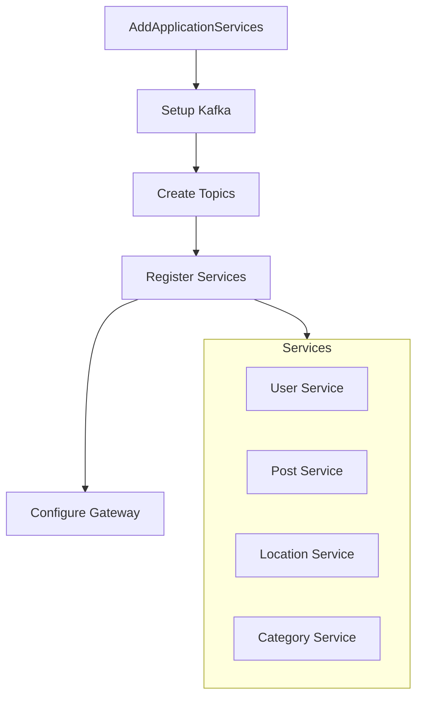
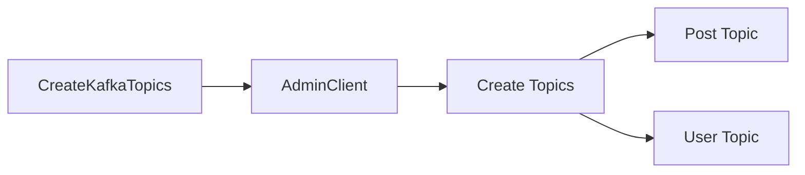
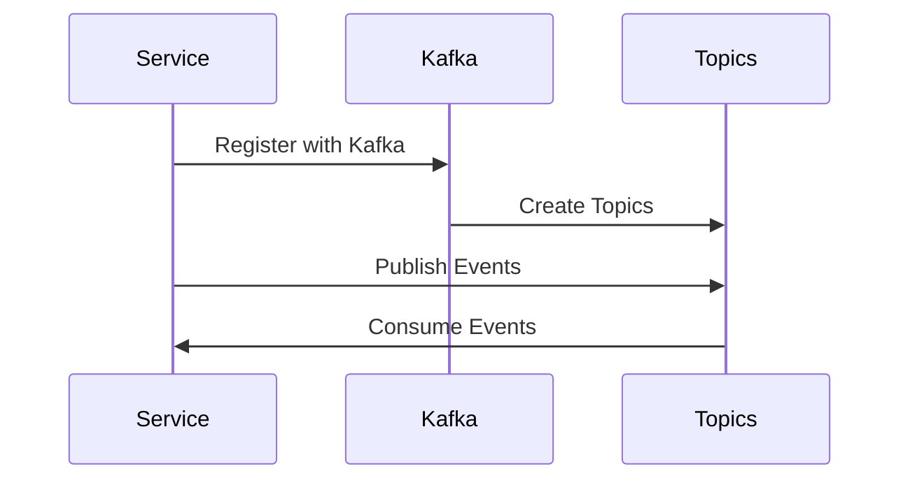

# ExternalServiceRegistrationExtentions Guide 🔧

> Class tiện ích mở rộng để cấu hình và đăng ký các microservice trong Aloha Market

## 📋 Tổng Quan

Class này cung cấp các extension methods để:
- Cấu hình Kafka cho microservices
- Đăng ký các service với hệ thống
- Thiết lập topic cho event-driven communication

## 🔑 Các Component Chính

### 1. Constants
```csharp
private static class Consts
{
    public const string Env_EventPublishingTopics = "EVENT_PUBLISHING_TOPICS";
    public const string Env_EventConsumingTopics = "EVENT_CONSUMING_TOPICS";
}
```

### 2. Service Registration Method


### 3. Topic Management


## 🛠️ Hướng Dẫn Sử Dụng

### Đăng Ký Service Mới

```csharp
// Đăng ký basic service
var newService = builder.AddProjectWithPostfix<Your_Service>();

// Đăng ký service với Kafka
var newService = builder.AddProjectWithPostfix<Your_Service>()
    .SetupKafka<Your_Service>(
        kafka,
        "other-service-topic-to-consume"
    );
```

### Cấu Hình Kafka

```csharp
// Cấu hình cơ bản
.SetupKafka<TProject>(kafkaResource)

// Cấu hình với consuming topics
.SetupKafka<TProject>(
    kafkaResource,
    GetTopicName<OtherService1>(),
    GetTopicName<OtherService2>()
)
```

## 📝 Lưu Ý Quan Trọng

1. **Topic Naming Convention**
   - Topics được tạo tự động theo tên service
   - Format: `{ServiceName}-{Postfix}`
   - Dấu gạch dưới (`_`) được thay thế bằng dấu gạch ngang (`-`)

2. **Environment Variables**
   - `EVENT_PUBLISHING_TOPICS`: Topics service sẽ publish
   - `EVENT_CONSUMING_TOPICS`: Topics service sẽ subscribe

3. **Service Dependencies**
   - Services phải chờ Kafka khởi động (`.WaitFor(kafka)`)
   - Gateway service cần reference tới tất cả services

## 🔄 Service Flow



## 🚫 Common Pitfalls

1. Quên thêm `.WaitFor(kafka)`
2. Sai tên topic khi configure
3. Thiếu reference trong Gateway service

## 📚 Best Practices

1. **Naming**
   ```csharp
   // Good
   GetTopicName<UserService>()
   
   // Avoid
   "user-service-topic"
   ```

2. **Service Registration**
   ```csharp
   // Good
   .AddProjectWithPostfix<TService>()
   .SetupKafka<TService>(kafka)
   .WithReference(otherServices)
   
   // Avoid
   .AddProjectWithPostfix<TService>()
   ```

3. **Topic Management**
   - Luôn định nghĩa topics trong `CreateKafkaTopics`
   - Sử dụng logging để track topic creation

## 🆘 Troubleshooting

- **Topics không được tạo?**
  Kiểm tra `KAFKA_AUTO_CREATE_TOPICS_ENABLE`

- **Service không nhận được events?**
  Verify `EVENT_CONSUMING_TOPICS` configuration

- **Connection issues?**
  Kiểm tra Kafka connection string và service references

---