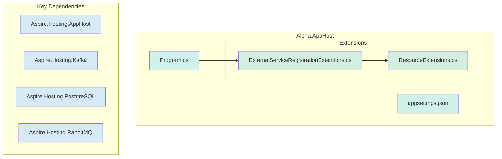
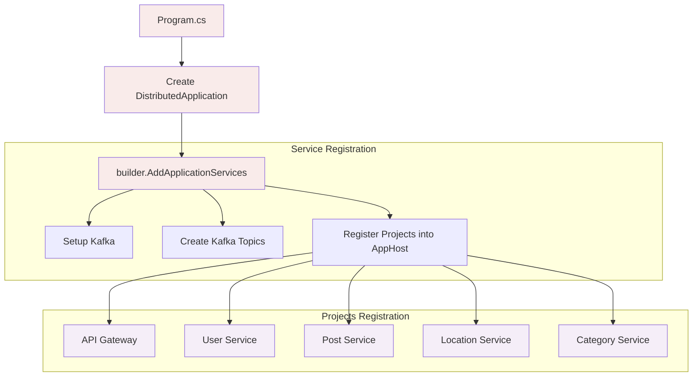
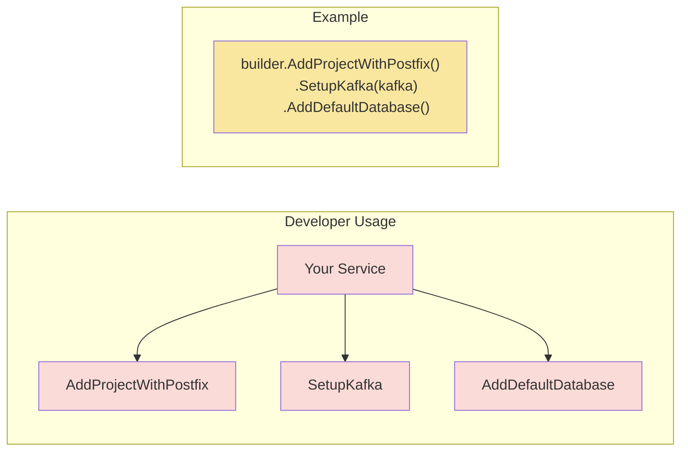

# Aloha.AppHost - Service Orchestrator

> Trung tâm điều phối của hệ sinh thái microservices Aloha Market, được xây dựng bằng .NET Aspire

## 🎯 AppHost Là Gì?

Aloha.AppHost là trung tâm đầu não của Aspire
- 🔐 Kiểm soát việc đăng ký service
- 🎵 Điều phối giao tiếp giữa các service
- 🔌 Quản lý luồng sự kiện Kafka
- 🗄️ Xử lý kết nối database

## 🗺️ Cấu Trúc Dự Án

### File Chính
```
Aloha.AppHost/
├── 📄 Program.cs                           # Program.cs mặc định, ko động vào nhiều
├── 📂 Extensions/
│   ├── 📄 ExternalServiceRegistration.cs   # Logic chính của AppHost: đk service, cầu hình, ...
│   └── 📄 ResourceExtensions.cs            # Chứa các extension method cho việc đk service, local db dễ dàng hơn
└── ⚙️ appsettings.json                     # File cấu hình
```

## 📊 Sơ Đồ Kiến Trúc

### Cấu Trúc và Dependencies của Project


### Luồng Đăng Ký Service


### Cách Sử Dụng Extension Methods


---
## 🛠️ Hướng Dẫn Cho Developer

### Thêm Service Mới

1. Tạo project service của bạn
2. Đăng ký trong AppHost theo mẫu:
```csharp
builder.AddProjectWithPostfix<Your_Service>()
       .SetupKafka<Your_Service>(kafka, "consuming-topics")
       .WithReference(otherServices);
```

### Thành Phần Chính
- 🎯 **Program.cs**: Điểm khởi đầu
- 🔧 **ExternalServiceRegistrationExtentions.cs**: Cấu hình service
- 🧰 **ResourceExtensions.cs**: Phương thức tiện ích
- 📡 **Kafka**: Bắt buộc cho mọi service

---
## Nguyên Tắc Kiến Trúc

1. **Giao Tiếp Event-Driven**
   - Các service giao tiếp qua Kafka topics
   - Liên kết lỏng lẻo giữa các service
   - Mặc định là bất đồng bộ

2. **Service Độc Lập**
   - Mỗi service có database riêng
   - Có thể triển khai độc lập
   - Ranh giới service rõ ràng

3. **Infrastructure as Code**
   - Mọi cấu hình đều bằng C#
   - Thiết lập được quản lý version
   - Triển khai có thể lặp lại

---

## 📝 Lưu Ý

> **Luôn đăng ký service mới trong ExternalServiceRegistrationExtentions.cs**
- Cấu hình Kafka topics cho giao tiếp event
- Sử dụng extension methods để đảm bảo tính nhất quán
- Tuân thủ các mẫu thiết kế đã thiết lập
---