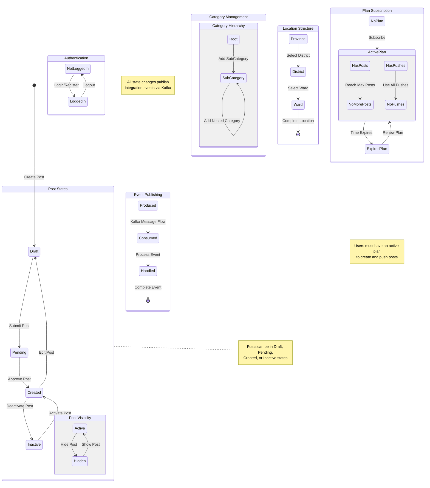
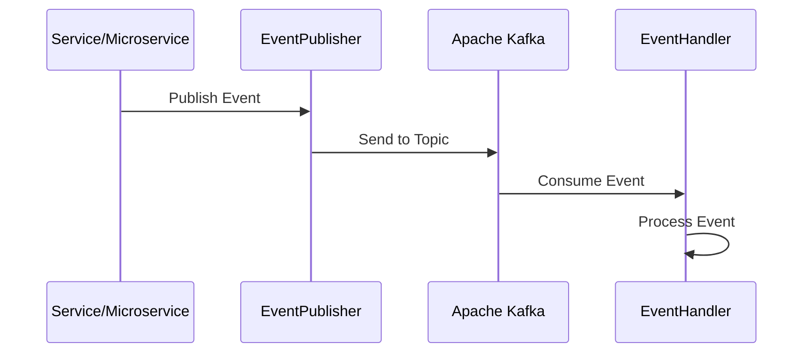

# 🌺 Aloha Market - Microservices Architecture

> A modern marketplace platform built with .NET Aspire and microservices architecture

## 📋 Overview

Aloha Market is a sophisticated marketplace platform built using .NET Aspire, implementing a microservices architecture with event-driven communication through Apache Kafka. The platform enables users to create, manage, and interact with marketplace listings through various specialized services.

## 🏗️ Architecture

### Core Services

- **API Gateway** (`Aloha.ApiGateway`): Entry point for all client requests
- **User Service** (`Aloha.UserService`): Handles user management and authentication
- **Post Service** (`Aloha.MicroService.Post`): Manages marketplace listings
- **Category Service** (`Aloha.CategoryService`): Handles category hierarchies
- **Location Service** (`Aloha.LocationService`): Manages location-based features
- **Plan Service** (`Aloha.MicroService.Plan`): Handles subscription plans
- **Payment Service** (`Aloha.MicroService.Payment`): Processes payments

### Infrastructure Components

- **Event Bus** (`Aloha.EventBus`): Core event-driven communication system
- **Kafka Integration** (`Aloha.EventBus.Kafka`): Apache Kafka implementation
- **Service Defaults** (`Aloha.ServiceDefaults`): Shared service configurations
- **Security** (`Aloha.Security`): Common security features
- **Shared Library** (`Aloha.Shared`): Shared utilities and models

## 🔄 State Machine Diagram



## 🚀 Getting Started

### Prerequisites

- .NET 8.0 or later
- Docker Desktop
- Visual Studio 2022 or later
- PostgreSQL (optional for local development)

### Setup

1. **Clone the Repository**
```powershell
git clone https://github.com/your-username/AlohaMarket.Aspire.git
cd AlohaMarket.Aspire
```

2. **Environment Setup**
```powershell
# Set required environment variables
setx DB_USERNAME "your_username"
setx DB_PASSWORD "your_password"
setx Aloha_PostDB_ConnectionString "your_connection_string"
```

3. **Run the Project**
```powershell
# Using Visual Studio
Open Aloha.Aspire.sln and run Aloha.AppHost

# Using CLI
dotnet run --project Aloha/Aloha.AppHost
```

## 🔌 Service Communication

### Event-Driven Architecture

- Services communicate asynchronously through Kafka topics
- Each service has its own database
- Events are published and consumed through the EventBus

### Integration Events Flow



## 🛠️ Development Guide

### Adding a New Service

1. Create a new project following the existing service template
2. Register the service in `Aloha.AppHost`:
```csharp
builder.AddProjectWithPostfix<Your_Service>()
       .SetupKafka<Your_Service>(kafka)
       .WithReference(otherServices);
```

### Best Practices

1. **Event Publishing**
   - Use integration events for cross-service communication
   - Follow the event naming convention
   - Implement proper error handling

2. **Database Management**
   - Each service manages its own database
   - Use migrations for schema changes
   - Follow the repository pattern

3. **Security**
   - Implement JWT authentication
   - Use environment variables for sensitive data
   - Follow the principle of least privilege

## 📚 Documentation

- Service documentation is available in each service's directory
- API documentation is available through Swagger UI
- Event documentation is maintained in the EventBus project

## 🤝 Contributing

1. Fork the repository
2. Create a feature branch
3. Commit your changes
4. Push to the branch
5. Create a Pull Request

## 📄 License

This project is licensed under the Unlicense License - see the [LICENSE](LICENSE.txt) file for details.

---
Built with 🌺 by Aloha Market Team
