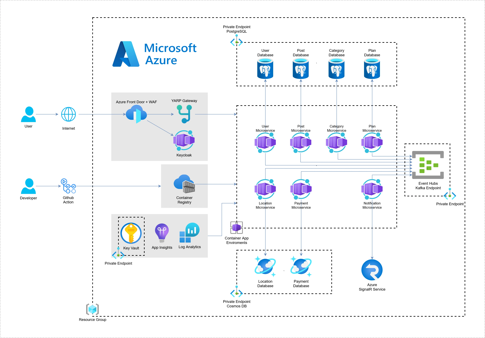
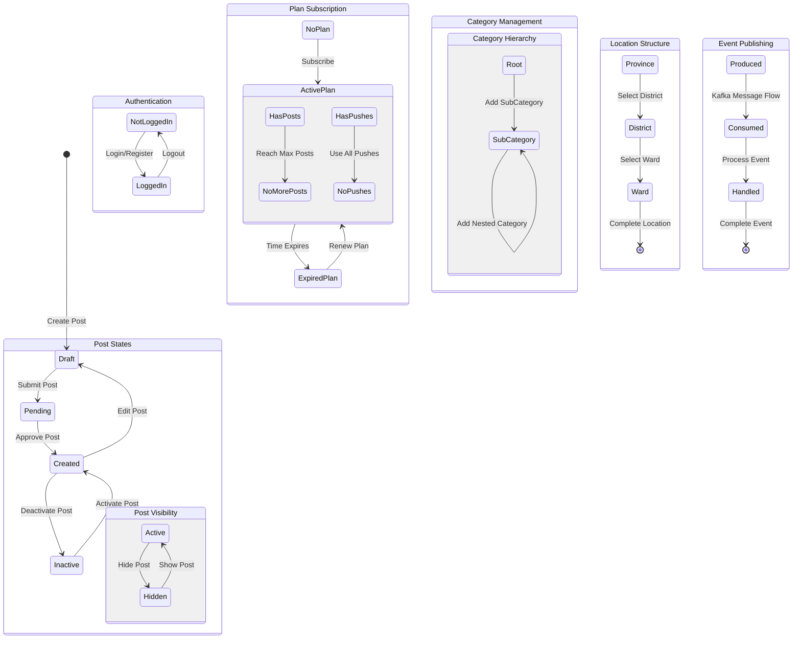
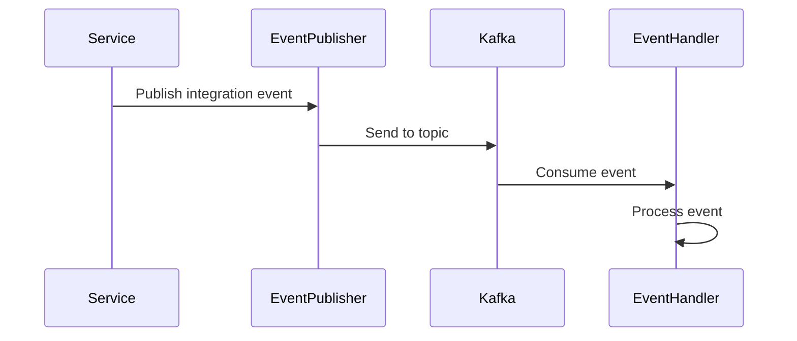

# Aloha Market (Aspire)
Aloha Market is a .NET 9 microservices backend for a marketplace platform. The solution uses .NET Aspire for orchestration, Kafka for asynchronous integration, and YARP as the API gateway.

## Overview

The system is designed around independent business services and data ownership:

- User profiles, roles, and JWT-based authentication with Keycloak
- Marketplace listings with media upload, search, and moderation workflows
- Category and location validation with seed data
- Subscription plans and user plan provisioning
- VNPay and Momo payment flows with callbacks
- Real-time chat and notifications with SignalR
- Event-driven service communication over Kafka

## Deployment architecture

The diagram below shows a reference deployment topology for the platform.



### Deployment highlights

- Azure Front Door + WAF protects the public entry point before traffic reaches the YARP gateway.
- Azure Container Registry and Azure Container Apps host the gateway, Keycloak, and microservices.
- Azure Database for PostgreSQL stores User, Post, Category, and Plan service data.
- Azure Cosmos DB stores Location and Payment service data.
- Azure Event Hubs Kafka endpoint provides managed event streaming for service-to-service integration.
- Azure Key Vault, Application Insights, Log Analytics, Azure SignalR, and Private Endpoints provide secrets management, observability, realtime messaging, and network isolation.

## Domain model

### State machine


```mermaid
stateDiagram-v2
    [*] --> Draft: Create Post

    state "Authentication" as Auth {
        NotLoggedIn --> LoggedIn : Login/Register
        LoggedIn --> NotLoggedIn : Logout
    }

    state "Post States" as Post {
        Draft --> Pending : Submit Post
        Pending --> Created : Approve Post
        Created --> Draft : Edit Post
        Created --> Inactive : Deactivate Post
        Inactive --> Created : Activate Post

        state "Post Visibility" as Visibility {
            Active --> Hidden : Hide Post
            Hidden --> Active : Show Post
        }
    }

    state "Plan Subscription" as Plan {
        NoPlan --> ActivePlan : Subscribe
        ActivePlan --> ExpiredPlan : Time Expires
        ExpiredPlan --> ActivePlan : Renew Plan

        state ActivePlan {
            HasPosts --> NoMorePosts : Reach Max Posts
            HasPushes --> NoPushes : Use All Pushes
        }
    }

    state "Category Management" as Category {
        state "Category Hierarchy" as CH {
            Root --> SubCategory : Add SubCategory
            SubCategory --> SubCategory : Add Nested Category
        }
    }

    state "Location Structure" as Location {
        Province --> District : Select District
        District --> Ward : Select Ward
        Ward --> [*] : Complete Location
    }

    state "Event Publishing" as Events {
        Produced --> Consumed : Kafka Message Flow
        Consumed --> Handled : Process Event
        Handled --> [*] : Complete Event
    }
```

## Services

### Runtime services

| Service              | Project                        | Responsibilities                                                      | Data store | Integrations          |
| -------------------- | ------------------------------ | --------------------------------------------------------------------- | ---------- | --------------------- |
| API Gateway          | `Aloha.ApiGateway`           | Reverse proxy, routing, CORS, auth header forwarding, request logging | None       | YARP, Keycloak JWT    |
| User Service         | `Aloha.UserService`          | User profiles, avatars, admin status, seller info                     | PostgreSQL | Cloudinary, Kafka     |
| Post Service         | `Aloha.MicroService.Post`    | Listings, filtering, search, status changes, reports, moderation      | PostgreSQL | Cloudinary, Kafka     |
| Category Service     | `Aloha.CategoryService`      | Category CRUD, hierarchy path, seed data                              | PostgreSQL | Kafka                 |
| Location Service     | `Aloha.LocationService`      | Province, district, and ward lookup data                              | MongoDB    | Kafka                 |
| Plan Service         | `Aloha.MicroService.Plan`    | Subscription plans, user plans, admin reporting                       | PostgreSQL | Kafka, Keycloak roles |
| Payment Service      | `Aloha.MicroService.Payment` | Payment records, VNPay and Momo flows, callbacks                      | MongoDB    | Kafka                 |
| Notification Service | `Aloha.NotificationService`  | Conversations, messages, SignalR hub, chat notifications              | MongoDB    | Kafka, SignalR        |

### Shared libraries

- `Aloha.EventBus`: integration event abstractions and MediatR-based dispatch
- `Aloha.EventBus.Kafka`: Kafka producer and consumer wiring using Aspire.Confluent.Kafka
- `Aloha.EventBus.Models`: typed contracts for posts, plans, payments, chat, and validation events
- `Aloha.Security`: Keycloak JWT authentication extensions and claims helpers
- `Aloha.Shared`: response helpers, validation attributes, converters, middleware, and common utilities
- `Aloha.ServiceDefaults`: OpenTelemetry, health checks, service discovery, Cloudinary, and shared dependency registration
- `Aloha.AppHost`: Aspire AppHost that wires projects and Kafka topics

## Integration model

Each service publishes to a Kafka topic derived from its Aspire project name. AppHost assigns `EVENT_PUBLISHING_TOPICS` and `EVENT_CONSUMING_TOPICS` for each service and creates the required topics during startup.

### Event flow


```mermaid
sequenceDiagram
    participant Service as Service
    participant Publisher as EventPublisher
    participant Kafka as Kafka
    participant Consumer as EventHandler

    Service->>Publisher: Publish integration event
    Publisher->>Kafka: Send to topic
    Kafka->>Consumer: Consume event
    Consumer->>Consumer: Process event
```

### Topic wiring

| Publishing service topic        | Consuming topics configured in AppHost                                                                                                                    |
| ------------------------------- | --------------------------------------------------------------------------------------------------------------------------------------------------------- |
| `Aloha-MicroService-User`     | `Aloha-MicroService-Post`, `Aloha-MicroService-Location`, `Aloha-NotificationService`                                                               |
| `Aloha-MicroService-Post`     | `Aloha-MicroService-User`, `Aloha-MicroService-Location`, `Aloha-MicroService-Plan`, `Aloha-MicroService-Category`, `Aloha-NotificationService` |
| `Aloha-MicroService-Plan`     | `Aloha-MicroService-User`, `Aloha-MicroService-Post`, `Aloha-MicroService-Payment`                                                                  |
| `Aloha-MicroService-Location` | `Aloha-MicroService-Post`                                                                                                                               |
| `Aloha-MicroService-Category` | `Aloha-MicroService-Post`                                                                                                                               |
| `Aloha-MicroService-Payment`  | `Aloha-MicroService-Plan`                                                                                                                               |
| `Aloha-NotificationService`   | `Aloha-MicroService-User`, `Aloha-MicroService-Post`                                                                                                  |

## Data ownership

| Service              | Store      |
| -------------------- | ---------- |
| API Gateway          | None       |
| User Service         | PostgreSQL |
| Post Service         | PostgreSQL |
| Category Service     | PostgreSQL |
| Plan Service         | PostgreSQL |
| Location Service     | MongoDB    |
| Payment Service      | MongoDB    |
| Notification Service | MongoDB    |

## Technology stack

### Platform

- .NET 9 / ASP.NET Core
- .NET Aspire
- Apache Kafka
- YARP Reverse Proxy
- PostgreSQL + EF Core + Npgsql
- MongoDB
- Keycloak JWT authentication
- OpenTelemetry
- SignalR
- Cloudinary + ImageSharp
- Docker

### Key packages

- `Aspire.Hosting.AppHost`
- `Aspire.Hosting.Kafka`
- `Aspire.Hosting.MongoDB`
- `Aspire.Hosting.PostgreSQL`
- `Aspire.Hosting.Azure.SignalR`
- `Aspire.Hosting.RabbitMQ`
- `Aspire.Confluent.Kafka`
- `MediatR`
- `AutoMapper`
- `Microsoft.EntityFrameworkCore`
- `Npgsql.EntityFrameworkCore.PostgreSQL`
- `MongoDB.Driver`
- `Microsoft.AspNetCore.Authentication.JwtBearer`
- `Yarp.ReverseProxy`
- `Swashbuckle.AspNetCore`
- `OpenTelemetry.*`
- `AspNetCore.HealthChecks.NpgSql`
- `CloudinaryDotNet`
- `SixLabors.ImageSharp`
- `dotenv.net`

## Configuration

### Kafka

- `EVENT_PUBLISHING_TOPICS`
- `EVENT_CONSUMING_TOPICS`
- Connection string named `kafka` when running outside Aspire

### API gateway

- `ReverseProxy` routes and clusters in configuration

### Keycloak JWT

- `Authentication:Authority`
- `Authentication:Audience`

### Cloudinary

- `CLOUDINARY_CLOUDNAME`
- `CLOUDINARY_APIKEY`
- `CLOUDINARY_APISECRET`

### PostgreSQL

- `ConnectionStrings:SupabaseConnection`
- `ConnectionStrings:DefaultConnection`
- `ConnectionStrings:PostgresConnection`

### MongoDB

- Location service: `MongoSettings:ConnectionString`, `MongoSettings:DatabaseName`
- Payment service: `MongoSettings:ConnectionString`, `MongoSettings:DatabaseName`, `MongoSettings:CollectionName`
- Notification service: `MongoDbSettings:ConnectionString`, `MongoDbSettings:DatabaseName`

### Payment providers

- VNPay: `Vnpay:Version`, `Vnpay:Command`, `Vnpay:TmnCode`, `Vnpay:CurrCode`, `Vnpay:Locale`, `Vnpay:BaseUrl`, `Vnpay:HashSecret`
- Payment callback: `PaymentCallBack:ReturnUrl`, `TimeZoneId`
- Momo: `MomoAPI:PartnerCode`, `MomoAPI:AccessKey`, `MomoAPI:SecretKey`, `MomoAPI:MomoApiUrl`, `MomoAPI:ReturnUrl`, `MomoAPI:NotifyUrl`, `MomoAPI:RequestType`
- Frontend redirects: `FrontendRedirect:SuccessUrl`, `FrontendRedirect:FailedUrl`

### Observability

- `OTEL_EXPORTER_OTLP_ENDPOINT`

## Local development

### Prerequisites

- .NET 9 SDK
- Docker Desktop
- PostgreSQL and MongoDB instances
- Keycloak
- Cloudinary account

### Run the full solution with Aspire

```powershell
dotnet run --project Aloha/Aloha.AppHost
```

### Run a single service

```powershell
dotnet run --project Aloha.UserService
```

Provide the required Kafka, database, and authentication settings when running a single service outside AppHost.

### Optional PostgreSQL container

```powershell
docker compose up -d
```

## API documentation

Each service exposes Swagger UI in development. The UI is hosted at the service root (`/`) and OpenAPI is available at `/openapi/v1.json`.

## Repository layout

- `Aloha.Aspire.sln`: solution entry point
- `Aloha/Aloha.AppHost`: Aspire AppHost wiring, project references, topic creation
- `Aloha.ApiGateway`: YARP reverse proxy and auth forwarding
- `Aloha.UserService`
- `Aloha.MicroService.Post`
- `Aloha.CategoryService`
- `Aloha.LocationService`
- `Aloha.MicroService.Plan`
- `Aloha.MicroService.Payment`
- `Aloha.NotificationService`
- `Aloha.EventBus`, `Aloha.EventBus.Kafka`, `Aloha.EventBus.Models`: event bus and contracts
- `Aloha.Security`, `Aloha.Shared`, `Aloha/Aloha.ServiceDefaults`: shared cross-cutting components
- `docker-compose.yml`: local PostgreSQL and pgAdmin for development

## Development notes

### Adding a new service

1. Create a new project following the existing service structure.
2. Register the service in `Aloha.AppHost`.
3. Configure Kafka topics and service references.
4. Add the service-specific datastore and integration settings.

Example:

```csharp
builder.AddProjectWithPostfix<Your_Service>()
       .SetupKafka<Your_Service>(kafka)
       .WithReference(otherServices);
```

### General practices

- Use integration events for cross-service communication.
- Keep database ownership inside each service.
- Use migrations for schema changes.
- Keep sensitive values in environment variables or secret stores.
- Apply least-privilege access to infrastructure and service dependencies.

## Contributing

1. Fork the repository.
2. Create a feature branch.
3. Commit your changes.
4. Push the branch.
5. Open a pull request.

## License

This project is licensed under the Unlicense License. See `LICENSE.txt`.
